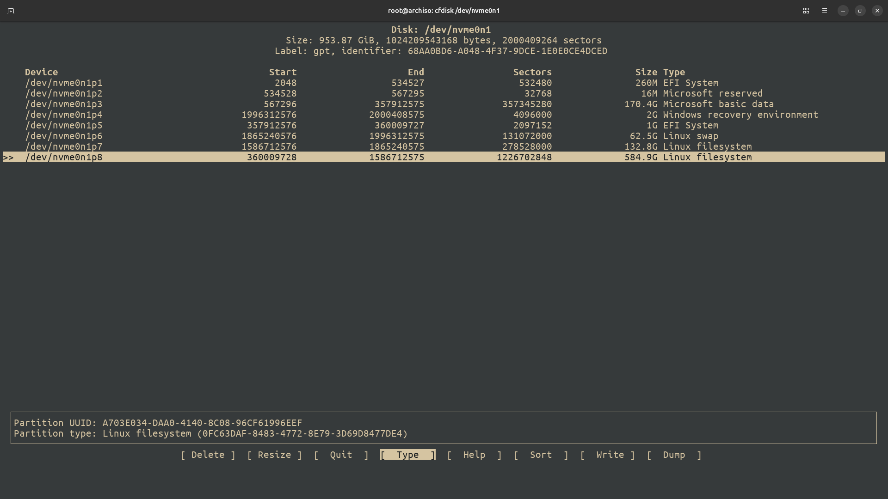

# Arch Install

> This repository demonstrates steps to install Arch Linux alongside with Ubuntu...the easy way!

Prerequisite:
- Installed Ubuntu
- A free partition

## Wi-Fi

Plug eternet cable directly to your laptop or connect to wi-fi with following command:  

**List available network devices**  
```bash
# Identify your wireless network interface
ip a show
```

**List available SSID**  
```bash
iwctl
# In my case, wlan0 is my wireless network interface
station wlan0 get-networks
# Connect to your preferred SSID
station wlan0 connect
```

## SSH

First, check whether ssh service is running and available.  
```bash
systemctl status sshd
```

If it is running and available, you can proceed to the next command.
Otherwise, just start it!  
```bash
systemctl start sshd
```

Now, identify your ip address!  
```bash
# Idenfitfy your ip address
ip a show
```

Now, provide a root password for the installer.
This is to allow remote access, otherwise, you won't be able to do that.  
```bash
passwd
```

Now use it on another machine to ssh in!  
```bash
ssh root@192.168.10.109
```

## Partition

**Obtain names of the blocks**  
```bash
lsblk
# For my case, it is nvme0n1
```

**Create partitions**  
```bash
# We will need a partition for boot and another for our OS
cfdisk /dev/nvme0n1
# I create these two partitions, ensure that the type is correct
# Then write!
# /dev/nvme0n1p5       1G EFI System
# /dev/nvme0n1p8       584.9G Linux filesystem
```




## Filesystem

**Format EFI Partition**  
```bash
mkfs.fat -F32 /dev/nvme0n1p5
```

**Format OS Partition**  
```bash
mkfs.ext4 /dev/nvme0n1p8
```

## Mounting

**Mount root**  
```bash
mount /dev/nvme0n1p8 /mnt
```

**Mount boot**  
```bash
mount --mkdir /dev/nvme0n1p5 /mnt/boot
```

End result
```
NAME        MAJ:MIN RM   SIZE RO TYPE MOUNTPOINTS
loop0         7:0    0 824.9M  1 loop /run/archiso/airootfs
sda           8:0    1  14.3G  0 disk
├─sda1        8:1    1   999M  0 part
└─sda2        8:2    1   180M  0 part
nvme0n1     259:0    0 953.9G  0 disk
├─nvme0n1p1 259:8    0   260M  0 part
├─nvme0n1p2 259:9    0    16M  0 part
├─nvme0n1p3 259:10   0 170.4G  0 part
├─nvme0n1p4 259:11   0     2G  0 part
├─nvme0n1p5 259:12   0     1G  0 part /mnt/boot
├─nvme0n1p6 259:13   0  62.5G  0 part
├─nvme0n1p7 259:14   0 132.8G  0 part
└─nvme0n1p8 259:16   0 584.9G  0 part /mnt
```

## Installation

Use archinstall to install the rest!  

```bash
archinstall
```

Step1:  
**Disk configuration**  
Under `Disk configuration` -> `Partitioning` -> `Pre-mounted configuration`.
For Root mount directory: `/mnt`  

Step2:  
**Bootloader**  
Please select `Grub` for `Bootloader`.

Step3:  
**Hostname**
Set to something unique, e.g. `dell`

Step4:  
**Root password**

## Update BIOS

Finally, you are ready to use Arch Linux :D!
However, at the time of writing this note,
Ubuntu and Arch are using different grub version.
Hence, you will need to use the grub from Arch to search for Ubuntu 
instead of doing it the other way round. So please update your
BIOS to point to the correct grub, which is the EFI one.  

To discover your other OS with grub inside of arch, please read
this [article](https://github.com/BruceChanJianLe/linux-grub).

## Reference

- https://github.com/dreamsofautonomy/arch-from-scratch
- https://www.youtube.com/watch?v=YC7NMbl4goo
- https://www.youtube.com/watch?v=eUhsFV0xIQc
- https://www.youtube.com/watch?v=FxeriGuJKTM
